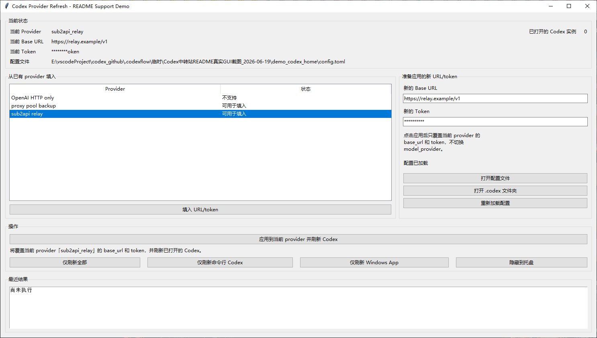

# Codex Relay Edition / Codex 中转站魔改版

Codex Relay Edition is a modified Codex CLI build for relay-provider workflows. Its core experience is simple: when requests fail, Codex keeps retrying automatically so you do not have to keep clicking continue; when a relay provider, sub2api gateway, proxy pool, or account pool starts acting up, Codex can refresh and switch provider details at runtime so it can try to route around the stuck path.

For users who rely on sub2api or similar relay gateways, the worst part is often not a single `503`. The real pain is when requests stay stuck to an already failing account, route, or client fingerprint, so every manual continue lands on the same failure again. This fork focuses on automatic retry, runtime refresh, and sticky fingerprint rotation to reduce the "infinite 503 until I manually intervene" loop and let Codex keep working for longer unattended sessions.

It is adapted from OpenAI Codex CLI, but it is not an official OpenAI release. If you only need the official upstream Codex CLI, use [`openai/codex`](https://github.com/openai/codex).

## Key Changes

- Built for relay provider and sub2api usage: point Codex at your own `base_url`, bearer token, account pool, or proxy route.
- More tolerant of transient upstream failures: when Codex hits `429`, `503`, `server_is_overloaded`, `slow_down`, `select model` capacity errors, or similar relay-side failures, it favors retrying and showing current state instead of stopping quickly.
- Route and fingerprint recovery after repeated failures: reduces the chance that one failing account, route, or client fingerprint keeps trapping every follow-up request.
- local2 visibility remains: CLI, TUI, version display, session history, and selected runtime behavior still make it clear this is the local modified build, not the official upstream build.
- Codex Provider Refresh: switch the active provider `base_url` and token without closing `codex.exe`.

## Codex Provider Refresh

Provider Refresh is a small Windows helper for this relay-focused workflow. Its job is direct: when Codex is already running and you want to replace the current provider `base_url` or token with another relay configuration, you do not need to close every `codex.exe` process and start over.

Tool path:

```text
scripts/windows_app_server_refresh_tray.py
```

<p align="center">
  
</p>

The screenshot above is captured from a real Python Tk GUI window. It uses a temporary demo configuration and does not read the user's real config; the provider, base URL, and token shown in the image are demo values, and the token is masked.

## Usage

1. Configure your provider, `base_url`, and token in the local Codex config according to your relay gateway requirements.
2. Start this modified Codex build normally.
3. If the relay becomes overloaded, the account pool needs to switch, or the token / route needs to change, use Provider Refresh to refresh the current provider.
4. For official Codex basics, command usage, and contribution flow, continue to use the official documentation and upstream repository.

## Relationship To Upstream

This repository keeps the baseline Codex CLI capabilities, but its default presentation and practical focus are relay-provider usage. It is for users who need relay providers, sub2api gateways, proxy pools, account pools, runtime refresh, and more tolerant retry behavior; it is not for users who want a completely unmodified official build.

Official entry points:

- Official documentation: <https://developers.openai.com/codex>
- Official upstream: <https://github.com/openai/codex>

## Notes

- This is a fork / modified build, not an official OpenAI release channel.
- README screenshots only show demo providers and masked tokens. Do not put real tokens, cookies, sessions, or account information in README screenshots.
- The README introduces the repository positioning and user-facing entry points; a README wording change does not by itself imply a new runtime implementation change.
- This repository remains under the [Apache-2.0 License](LICENSE).
