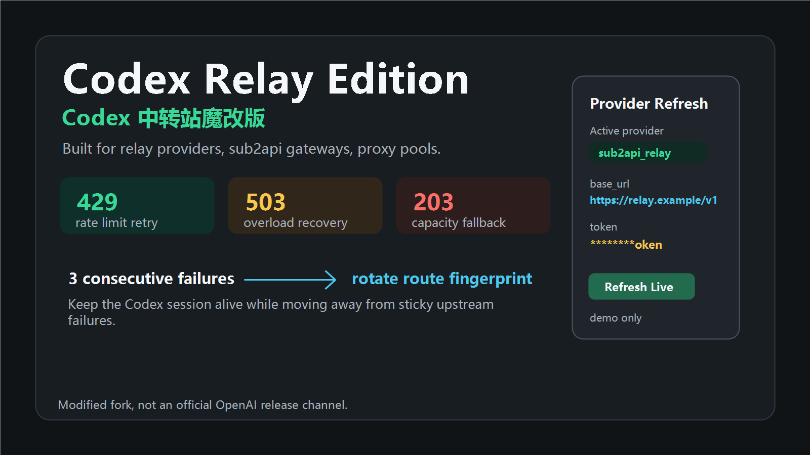
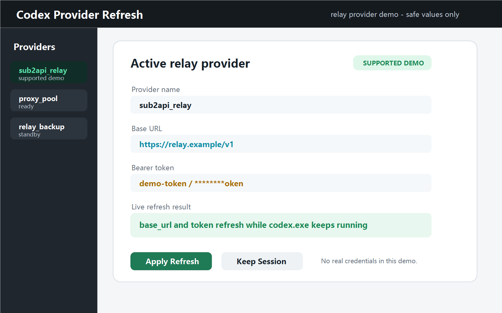

# Codex Relay Edition / Codex 中转站魔改版

<p align="center">
  
</p>

本仓库是 OpenAI Codex CLI 的 relay provider / sub2api / 代理池使用场景魔改分支，当前定位是 `Codex Relay Edition` / `Codex 中转站魔改版`。它是 fork / modified build，不是 OpenAI 官方发布渠道；官方上游仍是 `openai/codex`。

用户打开 GitHub 仓库首页后，第一眼应看到：这个版本面向中转站、relay provider、sub2api、代理池和 Provider Refresh 使用，而不是官方原版 Codex CLI 首页。

## 中转站优先展示点

- 面向 relay provider 和 sub2api：可以把 Codex 请求指向你的 `base_url`、bearer token、账号池或代理路由。
- 面向临时上游错误的持续重试展示口径：包括 `429`、`503`、`203`、`server_is_overloaded`、`slow_down`、`select model` 满载等。
- 连续 3 次失败后切换请求指纹 / 路由特征：减少同一账号、同一路由或同一客户端特征持续粘住错误的影响。
- Codex Provider Refresh：可在不关闭 `codex.exe` 的情况下切换当前中转的 `base_url` 和 token。
- 截图只展示 demo relay provider 和掩码 token，不展示真实 token、cookie、session 或账号凭据。

## Codex Provider Refresh

Provider：用户配置的 API 供应方或中转站入口。用户能直接感知为 Codex 请求打到哪个服务、走哪个账号或 token。

Base URL：API 请求服务器地址。用户能直接感知为 Codex 当前切到哪个中转站。

Token：访问中转站或 API 的凭据。README 和截图只能展示掩码或 demo token，不能展示真实凭据。

Provider Refresh 工具路径：

```text
E:\vscodeProject\codex_github\codex\scripts\windows_app_server_refresh_tray.py
```

<p align="center">
  
</p>

截图中的 provider 使用 `sub2api_relay`、`https://relay.example/v1`、`demo-token` 或 `********oken` 这类演示值。不要把真实 token、cookie、session、账号信息放进 README 或截图。

## 当前同步目标

- 当前包版本：`0.128.0`
- local2 清单：`docs/local2-custom-feature-checklist-2026-04-27.md`
- GitHub 首页展示入口：`README.md`
- 中文入口：`README.zh-CN.md`

## local2 保留能力

- CLI 帮助、TUI 状态区、历史单元、升级提示等版本展示继续显示 `<包版本>-local2`，让使用者能直接看出当前是 local2 构建；CLI `--version` 也有直接回归保护。
- `/responses` 主请求链继续保留更宽的临时失败重试能力，包括 `401` 与其他远端 HTTP 错误直接进入普通 retry、重试链日志降噪，以及保留可见重试提示。
- Provider runtime refresh 继续只刷新当前 provider 的 `base_url` 与 `experimental_bearer_token`，并保留 Windows tray 从配置复制 provider 字段后触发 refresh 的联动。
- Resume 历史列表默认可跨 provider 发现旧会话；Fork 场景仍保留当前 provider 过滤，避免把新分支接到错误来源上。
- 顶层 `force_service_tier_priority` hook 默认开启；开启后所有 `/responses` 请求都会在最底层请求构造处强制发送 `service_tier = "priority"`。显式设为 `false` 后恢复上游原始映射。
- 未显式设置 `RUST_LOG` 时，Windows app-server 与 TUI 默认保持日志降噪，减少日志输出、SQLite/文件写入占用和后台 I/O。
- brand-new 或 Clear 后的新普通线程，只有首个纯文本输入精确为 `你好` 时，才会在第一条可见 assistant 回复里注入 local2 清单；resume、fork、subagent、reviewer、guardian 以及不匹配的首轮输入都不会触发。
- rollout 批量 flush、app-server 高频通知合并、analytics / feedback / `log_db` 这些 runtime 负担优化默认关闭，只有在 `config.toml` 显式开启时才生效。

## 使用与发布说明

本仓库的首页展示改造只负责让 GitHub 项目页面更清楚地说明中转站魔改版定位，不等于新增 runtime 逻辑。发布与构建仍以仓库既有流程为准；本 README 展示任务不要求本地编译、不要求本地测试、不要求打包。

本仓库的 Windows release 以 GitHub Actions 产物为准，本地不需要、也不建议为了发布交付执行编译。这里的“最小 Windows release”指 GitHub 在云端 Windows runner 上编译并发布一个只包含 `codex.exe` 的 zip，避免把本机环境差异带进最终交付。

## 文档入口

- 英文首页：[`README.md`](./README.md)
- local2 清单：[`docs/local2-custom-feature-checklist-2026-04-27.md`](./docs/local2-custom-feature-checklist-2026-04-27.md)
- 官方 Codex 文档：<https://developers.openai.com/codex>
- 官方上游项目：<https://github.com/openai/codex>

本仓库继续遵循 [Apache-2.0 License](LICENSE)。
